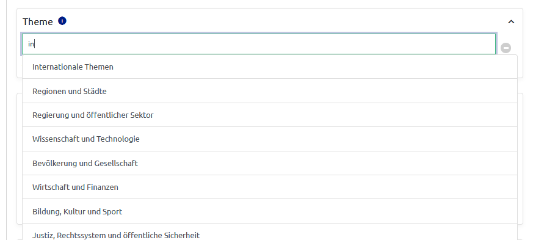
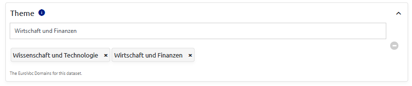
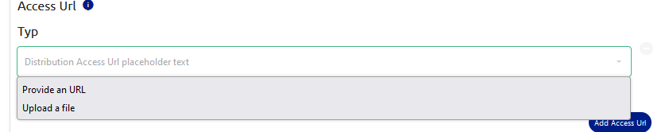
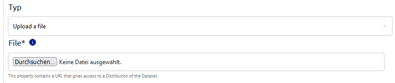
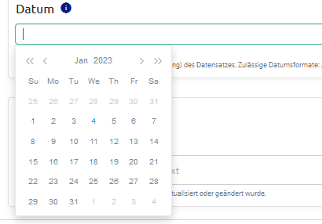
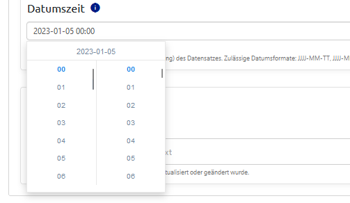
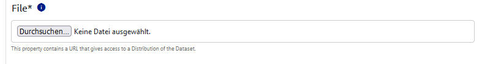

# Form Input Definition
The data provider interface (DPI) is a frontend presenting a multi-step form to the user providing the ability to upload data and metadata trough the given form. The given form and its content is based on the DCAT-AP specification which defines different classes and their properties.

To specify all properties and their behavior an object is provided within the file [dcatap-input-definition.js](../config/dcatap-input-definition.js). This file contains all definitions according to [VueFormulate schema](https://vueformulate.com/guide/forms/generating-forms/#schemas).

Currently the following classes and their properties are included:
* catalogue
* dataset
* distribution
* dataservice

This document provides a description on all definition keys and their purpose as well as linking to external sources for additional information.

## Table of Contents
---
* [1. Form properties](#1-form-properties)
    *  [1.1 General property keys](#11-general-property-keys)
        * [1.1.1 Type](#111-type)
        * [1.1.2 Name](#112-name)
        * [1.1.3 Class](#113-class)
        * [1.1.4 Value](#114-value)
        * [1.1.5 Validation](#115-validation)
        * [1.1.6 Options](#116-options)
        * [1.1.7 Children](#117-children)
        * [1.1.8 Repeatable](#118-repeatable)
    * [1.2 Custom property keys](#12-custom-property-keys)
        * [1.2.1 Identifier](#121-identifier)
        * [1.2.2 Minimum](#122-minimum)
        * [1.2.3 Voc](#123-voc)
        * [1.2.4 Multiple](#124-multiple)
        * [1.2.5 Data](#125-data)
    * [1.3 Event trigger](#13-event-trigger)
        * [1.3.1 @change](#131-change)
        * [1.3.2 @repeatableRemoved](#132-repeatableremoved)
* [2. Custom input components](#2-custom-input-components)
    * [2.1 Autocomplete input](#21-autocomplete-input)
    * [2.2 Conditional input](#22-conditional-input)
    * [2.3 DatePicker and DateTimePicker](#23-datepicker-and-datetimepicker)
    * [2.4 Fileupload](#24-fileupload)

# 1. Form properties
As already mentioned the frontend should provide a form for the classes catalogue, dataset, distribution and dataservice. Based on the configuration file each class will have its own subroute (except dataservice which is a part of distribution).

Each class consists of properties which need to be defined. All definitions are stored within a general object containing nested objects for each class and their properties defining their behavior, cardinality, validation rules...

    const dcatapProperties = {
        datasets: {...}, // definitions of all dataset properties
        distributions: {...}, // definitions of all distribution properties
        catalogues: {...} // definitions of all catalogues properties
    }

## 1.1 General property keys
---
All properties are described as key-value-pairs based on [VueFormulate schema](https://vueformulate.com/guide/forms/generating-forms/#schemas). Each key serves as keyword enabling a specific behavior.
There are some general keys provided by [VueFormulate](https://vueformulate.com/) which are needed to define the properties specified by DCAT-AP.

    property: {
        name: "...",
        type: "...",
        options: {1: "First option", 2: "Second option"},
        validation: "required",
        ...
    }

### 1.1.1 Type
---
**Mandatoy key**

The type defines which type of input form is used. There are numerous types defined by [VueFormulate](https://vueformulate.com/guide/inputs/types/button/)
e.g. buttons, textareas, slider, selects...

There are also custom types developed specific for the DPI (see chapter 2 for detailed description):
* autocomplete
* conditional
* datepicker
* fileupload

To use a specific type of input the name of this type should be provided as value:

    property:{
        type: "textarea",
        ...
    }

### 1.1.2 Name
---
The form should also fulfill the purpose of providing the data and metadata as semantic data including namespaces. To achieve this each property should include a name-key containing the namespaced property name based on DCAT-AP:

    issued: {
        type: "conditional",
        name: "dct:issued",
        ....
    }

For all namespaced property names see [DCAT-AP](https://www.dcat-ap.de/def/dcatde/2.0/spec/).

### 1.1.3 Class
---
The class-key conatins css-classes whcih should be applied to the defined input. There are already a few classes predefined:

| Class  | Description  |
|---|---|
| property  | A general class for each main property providing a border and some margins  |
| grid1r2c  | A class for a grid with 1 row and 2 columns  |

### 1.1.4 Value
---
The value-key provides a [predefined value](https://vueformulate.com/guide/inputs/#setting-an-initial-value) for the rendered input which can be changed using the form.

    language: {
        type: "select",
        name: "dct:language",
        value: "en", // englisch as predefined language tag
        ...
    }

### 1.1.5 Validation
---
VueFormulate provides the ability to assign [validation rules](https://vueformulate.com/guide/validation/) to an input. There are numerous predefined rules provided by VueFormulate and also the possibility to decalre new rules.

The validation-key can contain multiple rules.

    accessURL: {
        type: "conditional",
        name: "dct:accessUrl",
        validation: "required|url", //property is mandatory and needs to be a valid URL
        ...
    }

If a validation rule is not fulfilled the form can'tbe submitted as well asthe navigation will be disabled (only for mandatory properties). An additional modal will be displayed stating an error.

### 1.1.6 Options
---
**Mandatory property for selects and conditional inputs**

The [options-key](https://vueformulate.com/guide/inputs/types/select/#select-2) only is needed for inputs with type 'select' or 'conditional'. It contains the options the input should present.

The options can be provided as object or as a list of values. For selects both possibilities are valid. For conditional inputs the options should be provided as object with keys matching the prvided data attributes (see chapter 1.2.4 & 2.2).

    issued: {
        type: "conditional",
        name: "dct:issued",
        options: {date: "Date", datetime: "Datetime"},
        ....
    }

For language selects there is already a predefined language object which is mounted within the component and can be used.

    langauge: {
        type: "select",
        name: "@language",
        options: languages,
        ....
    }

### 1.1.7 Children
---
**Mandatory key for grouped properties**

This key is required for [grouped input](https://vueformulate.com/guide/inputs/types/group/) provided by VueFormulate! A group input bundles several inputs into one group. These nested inputs also need to be defined. This happens in an array of objects where each object contains the definition of a nested input.

    creator: {
        type: "group",
        name: "dct:creator",
        children: [
            {
                type: "text",
                name: "foaf:name",
                ...
            },
            {
                type: "url",
                name: "foaf:homepage",
                ...
            },
            ...
        ]
    }

### 1.1.8 Repeatable
---
**Only for grouped input**

The [repeatable-key](https://vueformulate.com/guide/inputs/types/group/#repeatable-groups) is only defined within groups making them repeatable. The value is a simple boolean determining if the grouped input should be repeatable or not.

    title: {
        type: "group",
        name: "dct:title",
        children: [...],
        repeatable: true,
        ...
    }

## 1.2 Custom property keys
---
Some properties specified by DCAT-AP require more complex inputs with very specific behavior. Therefore we implemented additional keys expanding the input definitions provided by VueFormulate.

### 1.2.1 Identifier
---
The identifier key serves multiple purposes. One of it is to provide a unique identifier for each input which later is used to run cypress tests.

The more important purpose is to add labels to all inputs. The provided identifier is also used as key within the translation files. Based on the identifier and type of the input the folowwing label/descirptions are added to the definition automatically:

* label
* placeholder
* help-text
* info
* add-label (only for repeatable groups)

    title: {
        identifier: "title",
        type: "group",
        name: "dct:title",
        ....
    }

### 1.2.2 Minimum
---
The minimum-keys was defined for mandatory properties which are repeatable (title, description, accessUrl...). If set to 1 it determines the minimum number of instances of repeatable inputs.

    title: {
        type: "group",
        name: "dct:title",
        children: [...],
        repeatable: true,
        validation: "required",
        minimum: 1,
        ...
    }

If the minimum is set it prevents the user to completely remove repetable inputs (remove button is disabled).

### 1.2.3 Voc
---
**Mandatory key for autocomplete inputs**

This key is rquired for autocomplete inputs and also only works for autocomplete inputs. It defines which vocabulary (specified by DCAT-AP) should be used for presenting options wihtin the input.

The key should only contain the name of the vocabulary which later will be extended to an URL for requesting the actual values of the vocabulary.

    subject: {
        type: "autocomplete-input",
        name: "dct:subject",
        voc: "eurovoc",
        ...
    }

A list of all available vocabularies from the OSC backend can be found [here](https://piveau-hub-search-data-europa-eu.apps.osc.fokus.fraunhofer.de/vocabularies/).

### 1.2.4 Multiple
---
**Only for autocomplete input**

This key only works for autocomplete inputs and requires a simple boolean value.
It determines wether an autocomplete inputaccepts multiple values or just one which will be overwritten on change. The key is not mandatory, so if it's not given the default are singular values.

also determines specific behavior in terms of data saving and formatting (see 2.1)

    subject : {
        identifier: "subject",
        name: "dct:subject",
        type: "autocomplete-input",
        voc: "eurovoc",
        multiple: true
    }

The key (if set to true) also determines that the provided values are saved within an array (e.g. ['value1', 'value2', ...]).

### 1.2.5 Data
---
**Mandatory key for conditional inputs**

This key is mandatory for conditional inputs and only works for these inputs.
The value of this key should be an object containing the keys defined within the value of the options object.

Each key within the provided object should be an array containing the inputs definition similar to the children-key for grouped inputs.

    issued: {
        name: "dct:issued,
        type: "conditional-input",
        options: {date: "Date", datetime: "DateTime"},
        data: {
            date: [
                {
                    name: "@value",
                    type: "date-picker",
                    ...
                }
            ],
            datetime: [
                {
                    name: "@value",
                    type: "datetime-picker",
                    ...
                }
            ]
        }
    }

Based on the chosen value from the select the matching input definition is rendered and displayed.

## 1.3 Event trigger
---
VueFormulate provided the possibility define event trigger which can be also integrated within the schema. The DPI uses two trigger so far to handle specific events.

### 1.3.1 @change
---
The @change trigger is a custom trigger emitting on each change within the form leading to saving all form values to the localStorage.

For nested inputs the trigger must be set to all nested properties otherwise their changes won't be considered.

    title: {
        type: "group",
        name: "dct:title",
        children: [
            {
                type: "text",
                name: "@value",
                "@change": true,
                ...
            }
        ]
    }

### 1.3.2 @repeatableRemoved
---
**Only for repetabale group inputs**

This [trigger](https://vueformulate.com/guide/inputs/types/group/#events) emits when an item from a repetabale input is removed via the remove button. It is used to remove the saved data value from the cached dataset.

The trigger is defined while using an @ and set to a boolean value:

    title: {
        type: "group",
        repetabale: true,
        name: "dct:title",
        children: [...],
        minimum: 1,
        "@repetableRemoved": true,
        ...
    }

# 2. Custom input components
VueFormulate provides a wide range of input fields but DCAT-AP sometimes requires a very specific behavior so we implemented custom input components ([custom inpt types](https://vueformulate.com/guide/inputs/custom-inputs/)).

## 2.1 Autocomplete input
---
Some properties need to provide values from a certain vocabulary. Since some ofthese vocabularies are quiet big a normal select isn't very useful. Therefore the autocomplete input was implemented.

This input type presents a normal text input field where the user can write something and based on the written value the vocabulary gets filtered. The first 10 filetered results are displayed as a list of choosable values.

Because some properties also alow multiple values the input type was also designed to collect multiple values (indicated by multiple keyword see chapter 1.2.4)

There are some additional key defined specifically for thistype of input to provide all needed values.

    theme: {
        identifier: "theme",
        name: "dcat:theme",
        type: "autocomplete-input",
        "@change": true,
        multiple: true, //specific for autocomplete-input (not mandatory)
        voc: "data-theme", // mandatory for autocomplete-input
        ...
    }

## 2.2 Conditional input
---
DCAT-AP specifies a few properties where the usershould be able to chosse betwenn different formats or event between providing the data manually or choosing from a vocabulary. Therefore a conditional input type is needed. VueFormulate supports [conditional inputs](https://vueformulate.com/guide/forms/#conditional-fields) but not to an extend that the inbuild functionality works while using schemas.

The implemented components consist of two parts. The first part is a select where the user can choose the wanted form of input.

The second part of the component renders the input field based on the chosen value. Therefore this components requires values for the options-keyword and especially values for the data-keyword, which should include the input definitions available.

Therefore some additional keys were implemented to provide all values needed for creating a conditioanl input.

    accessUrl: {
        identifier: 'accessUrl',
        name: '@id',
        type: 'conditional-input',
        '@change': true,
        options: { url: 'Provide URL', file: 'Upload file' },
        data: {
            // matching keys with options required!
            url: [
                {
                    identifier: 'accessUrlLink',
                    type: 'url',
                    name: '@id',
                    '@change': true,
                    validation: 'required|url',
                },
            ],
            file: [
                {
                    identifier: 'accessUrlFile',
                    type: 'fileupload',
                    name: '@id',
                    '@change': true,
                    validation: 'required',
                },
            ],
        },
    }

## 2.3 DatePicker and DateTimePicker
---
VueFormulate provides an input type for [date](https://vueformulate.com/guide/inputs/types/text/#date) and [datetime](https://vueformulate.com/guide/inputs/types/text/#datetime-local) but the datetime input is not supported by Firefox so we implemented two components using another library (vue2-datepicker).

One component using the library was designed to provide dates (Datepicker) the other one extends the Datepicker-component to enable providing datetimes (DateTimePicker)

These components need no additional keys. There can be used by just providing the type.

    issued: {
        identifier: "issued",
        name: "dct:issued",
        type: "date-picker", // or "datetime-picker"
        ...
    }

## 2.4 Fileupload
---
VueFormulate provides a [file input](https://vueformulate.com/guide/inputs/types/file/#file-2) but we needed the input to also behave in a certain way based on the response of the attempted upload ofthe file. Therefore we implemented a custom component utilizing the available file input.

The components provides information aboutwtehrer the upload was successful or not. Furthermore if it was sucessful it returns the location path of the uploaded file which needs to be saved as value within the dataset.

This component doesn't need additional keys, providing the input type is sufficient.

    accessUrl: {
        identifier: "accessUrl",
        name: "dcat:accessURL",
        "@change": true,
        type: "fileupload",
        ...
    }
